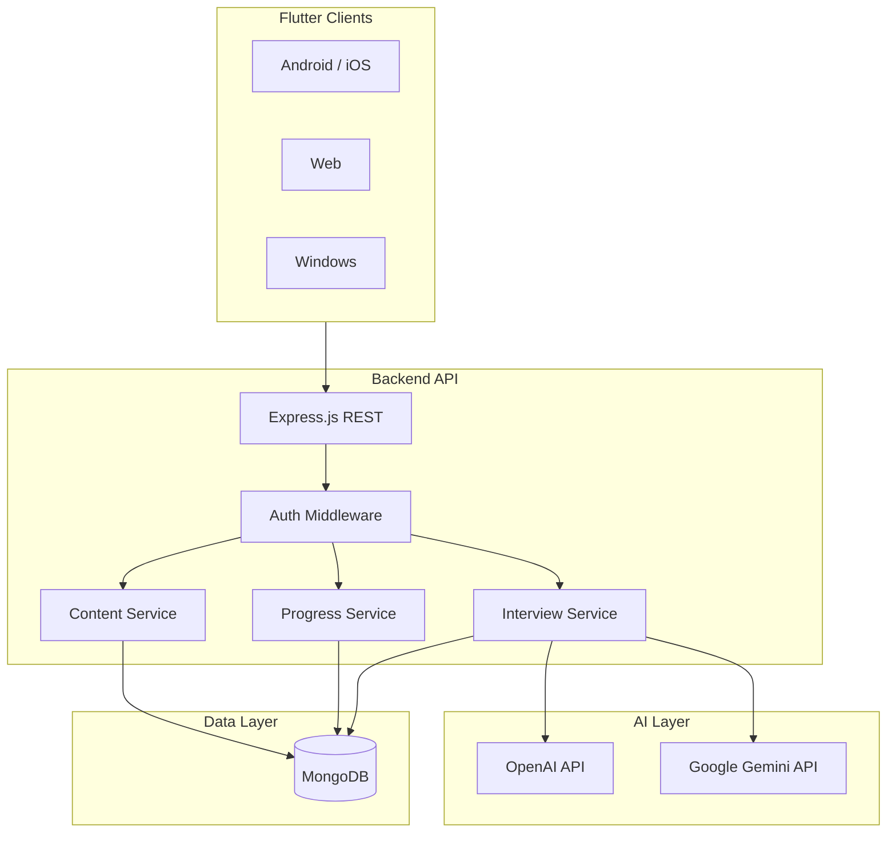

# Interactive Frontend Lab — System Requirements Document

**Document version:** 1.0.0  
**Last updated:** May 20, 2026  
**Platform:** Flutter (Android, iOS, Web, Windows)  
**Backend (planned):** Node.js, Express.js, MongoDB  
**AI providers (planned):** OpenAI API, Google Gemini API  

---

## Table of Contents

1. [Executive Summary](#1-executive-summary)
2. [Project Vision & Goals](#2-project-vision--goals)
3. [Scope Definition](#3-scope-definition)
4. [User Personas & Roles](#4-user-personas--roles)
5. [Functional Requirements](#5-functional-requirements)
6. [Non-Functional Requirements](#6-non-functional-requirements)
7. [System Architecture](#7-system-architecture)
8. [Technology Stack](#8-technology-stack)
9. [Data Model & Database](#9-data-model--database)
10. [AI Integration Requirements](#10-ai-integration-requirements)
11. [Application Flows](#11-application-flows)
12. [UI/UX Requirements](#12-uiux-requirements)
13. [Security & Compliance](#13-security--compliance)
14. [MVP Definition & Launch Criteria](#14-mvp-definition--launch-criteria)
15. [Post-MVP Roadmap](#15-post-mvp-roadmap)
16. [Acceptance Criteria](#16-acceptance-criteria)
17. [Glossary](#17-glossary)

---

## 1. Executive Summary

**Interactive Frontend Lab** is a gamified, visual-first learning and interview preparation platform for frontend developers. It combines interactive learning modules, AI-powered mock interviews, visual coding challenges, architecture playgrounds, timed simulation challenges, gamification, and community features.

The product must feel like a **modern gaming dashboard** fused with an **interactive learning platform** and a **futuristic interview simulator** (dark theme, animations, glowing cards, progress bars, smooth transitions).

This document defines **all** planned capabilities. Implementation follows a **phased approach**: MVP first (Section 14), then full feature set (Sections 5 and 15).

---

## 2. Project Vision & Goals

### 2.1 Vision

Become the most engaging way to learn frontend development and prepare for technical interviews through visuals, practice, AI feedback, and social competition.

### 2.2 Primary Goals

| ID | Goal | Success Metric |
|----|------|----------------|
| G-01 | Increase learning retention via visual + interactive content | ≥ 60% module completion rate |
| G-02 | Improve interview readiness | Measurable interview score improvement over 30 days |
| G-03 | Maximize daily engagement | DAU/MAU ratio, streak length, daily challenge completion |
| G-04 | Differentiate via AI Interview Simulator | NPS for interview feature ≥ 8/10 |
| G-05 | Support scalable content (topics, quizzes, activities) | Admin/content API without app redeploy for content updates |

### 2.3 Out of Scope (Initial Release)

- Native desktop-only features beyond Flutter targets
- Custom video hosting CDN (use embedded/third-party where needed)
- Enterprise SSO (Phase 3+)
- Full peer-to-peer code execution sandbox on device (server-side evaluation preferred)

---

## 3. Scope Definition

### 3.1 In Scope — Full Product

1. Interactive Learning Modules (10+ topics)
2. AI Interview Simulator (roles, modes, scoring)
3. Visual Coding Challenges
4. Architecture Playground
5. Frontend Simulation Challenges (timed builds)
6. Gamification (XP, streaks, badges, ranks)
7. Community Mode
8. Authentication & user profiles
9. Progress tracking & analytics
10. Code playground
11. Quiz system
12. Backend API + MongoDB persistence
13. AI services for generation, scoring, and code review

### 3.2 MVP Scope (Launch v1.0)

| Feature | MVP | Full Product |
|---------|-----|--------------|
| Authentication | ✅ | ✅ |
| React learning modules | ✅ | All topics |
| Quiz system | ✅ | ✅ |
| Interactive activities | ✅ (subset) | ✅ (all topics) |
| Mock interview chatbot | ✅ (text) | + voice, live coding |
| Progress tracking | ✅ | + advanced analytics |
| Code playground | ✅ (basic) | + full Monaco-like experience |
| Visual coding challenges | ❌ | ✅ |
| Architecture playground | ❌ | ✅ |
| Timed simulation challenges | ❌ | ✅ |
| Gamification (full) | Partial (XP, streak) | ✅ |
| Community mode | ❌ | ✅ |

**Rule:** Do **not** build everything at once. Ship MVP, validate retention and interview feature usage, then expand per roadmap (Section 15).

---

## 4. User Personas & Roles

### 4.1 Personas

| Persona | Description | Primary Needs |
|---------|-------------|---------------|
| **Junior Learner** | 0–1 years, learning React/JS | Visual explanations, guided activities, low-pressure quizzes |
| **Job Seeker** | Preparing for interviews | Mock interviews, scoring, weak-topic analytics |
| **MERN Developer** | Full-stack focus | Node, Express, MongoDB modules + MERN interview track |
| **Senior Frontend** | System design, architecture | Architecture playground, senior interview mode, performance topics |

### 4.2 System Roles

| Role | Permissions |
|------|-------------|
| **Guest** | Browse marketing/onboarding preview only (optional) |
| **Student** | All learning, quizzes, interviews, playground, community |
| **Content Admin** | CRUD modules, quizzes, activities (CMS API) |
| **System** | AI orchestration, scoring jobs, leaderboard aggregation |

---

## 5. Functional Requirements

### 5.1 Module: Interactive Learning Modules

#### 5.1.1 Topics (Full Catalog)

The platform **shall** support learning paths for:

| Topic ID | Topic Name |
|----------|------------|
| TOP-001 | React |
| TOP-002 | JavaScript |
| TOP-003 | Node.js |
| TOP-004 | Express |
| TOP-005 | MongoDB |
| TOP-006 | System Design |
| TOP-007 | Frontend Architecture |
| TOP-008 | APIs |
| TOP-009 | Authentication |
| TOP-010 | Performance Optimization |

**MVP:** React path only (TOP-001), with structure extensible to other topics.

#### 5.1.2 Per-Topic Content Structure

Each topic **shall** include:

| Content Type | Description | Requirement ID |
|--------------|-------------|----------------|
| Visual explanation | Animated/diagram-based concept teaching | FR-LM-01 |
| Activities | Hands-on drag/drop, ordering, matching, flow building | FR-LM-02 |
| Mini projects | Small scoped builds with checklist validation | FR-LM-03 |
| Interview questions | Topic-specific Q&A bank + AI follow-ups | FR-LM-04 |
| Quiz | Multiple choice, multi-select, code-output questions | FR-LM-05 |

#### 5.1.3 Example Learning Path — React (MVP)

Ordered units:

1. Components  
2. Props  
3. State  
4. Hooks  
5. useEffect  
6. Context API  
7. Redux  

Each unit **shall** link: animation → visual explanation → activity → quiz → optional interview simulation.

#### 5.1.4 Example Interactive Activity — Redux (Post-MVP Reference)

**FR-LM-06:** Visual UI showing components, store, actions, reducers. User drags actions into reducers and reducers into store; system validates order and shows animated data flow explanation.

---

### 5.2 Module: AI Interview Simulator (Flagship Feature)

#### 5.2.1 Interview Tracks

User **shall** select one track before session:

| Track ID | Track Name |
|----------|------------|
| INT-001 | Junior Frontend |
| INT-002 | React Developer |
| INT-003 | MERN Stack |
| INT-004 | Senior Frontend |

#### 5.2.2 Interview Session Flow

| Step | Behavior | Requirement ID |
|------|----------|----------------|
| 1 | AI asks question (from bank + generated) | FR-AI-01 |
| 2 | User answers (text/voice/code per mode) | FR-AI-02 |
| 3 | AI asks follow-up based on answer | FR-AI-03 |
| 4 | AI checks confidence/clarity (rubric) | FR-AI-04 |
| 5 | AI assigns score per question | FR-AI-05 |
| 6 | Session summary: total score, improvements | FR-AI-06 |

#### 5.2.3 Interview Modes

| Mode | MVP | Description |
|------|-----|-------------|
| Text interview | ✅ | Chat-style Q&A with typed answers |
| Voice interview | ❌ | Speech-to-text input, optional TTS for AI |
| Live coding | ❌ | In-editor problem + AI review of solution |

#### 5.2.4 Scoring Rubric (Minimum)

AI evaluation **shall** consider:

- Technical accuracy  
- Completeness  
- Clarity of explanation  
- Use of correct terminology  
- Depth (follow-up handling)  

Output per answer: numeric score (0–100), short feedback, suggested improved wording.

---

### 5.3 Module: Visual Coding Challenges

**Status:** Post-MVP (Full Product)

#### 5.3.1 Challenge Format

**FR-VC-01:** Challenges present a **broken application** (preview UI + console errors + described bugs), not plain LeetCode-style prompts only.

**Example:** “Fix the React App” — user sees broken app, console errors, state bugs.

#### 5.3.2 User Actions

| Action | Requirement ID |
|--------|----------------|
| Fix bugs in provided code | FR-VC-02 |
| Reorder components | FR-VC-03 |
| Connect APIs / fix integration | FR-VC-04 |
| Submit for automated + AI validation | FR-VC-05 |

#### 5.3.3 Feedback

System **shall** show: tests passed/failed, remaining errors, hints (tiered), XP reward on completion.

---

### 5.4 Module: Architecture Playground

**Status:** Post-MVP

#### 5.4.1 Capabilities

Users **shall** visually build:

- Component hierarchy  
- API request/response flow  
- Redux architecture (store/actions/reducers/components)  
- Authentication flow (login → token → protected routes)  

#### 5.4.2 Interaction Model

| Capability | Requirement ID |
|------------|----------------|
| Drag/drop nodes | FR-AP-01 |
| Connect nodes with edges (flow diagrams) | FR-AP-02 |
| Validate architecture against expected patterns | FR-AP-03 |
| Export/share diagram (image or JSON) | FR-AP-04 |

**Reference UX:** Excalidraw / FigJam / React Flow style (implemented in Flutter via graph/canvas libraries).

---

### 5.5 Module: Frontend Simulation Challenges

**Status:** Post-MVP

#### 5.5.1 Scenario Format

**FR-FS-01:** Timed real-world scenarios, e.g. “Company asks you to build Todo App in 30 minutes.”

#### 5.5.2 Requirements Checklist (Example — Todo App)

- API integration  
- CRUD operations  
- Input validation  
- Responsive UI  

#### 5.5.3 Timer & Submission

| Requirement | ID |
|-------------|-----|
| Countdown timer visible | FR-FS-02 |
| Auto-submit or manual submit on timeout | FR-FS-03 |
| AI reviews code architecture and implementation | FR-FS-04 |
| Structured feedback report | FR-FS-05 |

---

### 5.6 Module: Gamification

#### 5.6.1 Mechanics (Full Product)

| Mechanic | Description | MVP |
|----------|-------------|-----|
| XP points | Earned per quiz, activity, challenge, interview | ✅ |
| Streaks | Consecutive daily learning days | ✅ |
| Badges | Milestone achievements | Partial |
| Daily challenges | One featured task per day | Partial |
| Levels | XP thresholds unlocking content | ✅ |
| Frontend ranks | Title by level/performance | ✅ |

#### 5.6.2 Example Ranks

- React Apprentice  
- Hook Master  
- Frontend Architect  

**FR-GM-01:** Rank titles **shall** display on profile and dashboard.

#### 5.6.3 Rules

- XP **shall not** be negative; failed attempts may grant reduced XP or none (configurable).  
- Streak **shall** reset if user misses a calendar day (timezone: user profile TZ).  
- Leaderboards (community) optional in MVP, required in Community Mode phase.

---

### 5.7 Module: Community Mode

**Status:** Post-MVP

| Feature | Requirement ID |
|---------|----------------|
| Challenge friends | FR-CM-01 |
| Compare scores | FR-CM-02 |
| Join mock interviews (multi-user or async) | FR-CM-03 |
| Peer code review | FR-CM-04 |
| Weekly frontend battles | FR-CM-05 |

---

### 5.8 Module: Authentication

| Requirement | ID |
|-------------|-----|
| Email/password registration and login | FR-AUTH-01 |
| OAuth (Google, GitHub) — Phase 2 | FR-AUTH-02 |
| Password reset via email | FR-AUTH-03 |
| JWT or session token stored securely on device | FR-AUTH-04 |
| Profile: name, avatar, experience level, learning focus | FR-AUTH-05 |

---

### 5.9 Module: Quiz System

| Requirement | ID |
|-------------|-----|
| Quizzes per topic unit | FR-QZ-01 |
| Question types: MCQ, multi-select, true/false, code snippet output | FR-QZ-02 |
| Immediate feedback after submit | FR-QZ-03 |
| Passing score threshold (default 70%) | FR-QZ-04 |
| Retry with optional question shuffle | FR-QZ-05 |
| Store attempts in `quizzes` / user progress | FR-QZ-06 |

---

### 5.10 Module: Progress Tracking

| Data Point | Requirement ID |
|------------|----------------|
| Completed modules/units | FR-PR-01 |
| Quiz scores history | FR-PR-02 |
| Interview session scores | FR-PR-03 |
| Weak topics (derived from low scores) | FR-PR-04 |
| XP, level, streak | FR-PR-05 |
| Daily challenge status | FR-PR-06 |

#### 5.10.1 Performance Analytics (Full Product)

Dashboard **shall** show:

- Weak topics list  
- Confidence graph over time  
- Interview readiness score  
- Coding speed (simulation challenges)  

---

### 5.11 Module: Code Playground

| Requirement | ID |
|-------------|-----|
| Embedded code editor | FR-CP-01 |
| Syntax highlighting (JS/TS/React) | FR-CP-02 |
| Run/preview (MVP: local snippet eval or WebView; full: sandbox API) | FR-CP-03 |
| Save snippets to user account | FR-CP-04 |
| AI explain/review selected code | FR-CP-05 |

---

## 6. Non-Functional Requirements

### 6.1 Performance

| ID | Requirement |
|----|-------------|
| NFR-P-01 | App cold start &lt; 3s on mid-range devices |
| NFR-P-02 | Screen transitions &lt; 300ms |
| NFR-P-03 | API p95 latency &lt; 500ms for non-AI endpoints |
| NFR-P-04 | AI interview response streaming start &lt; 2s |

### 6.2 Scalability

| ID | Requirement |
|----|-------------|
| NFR-S-01 | Backend stateless horizontal scaling |
| NFR-S-02 | MongoDB indexed queries for user progress and leaderboards |
| NFR-S-03 | Rate limit AI endpoints per user tier |

### 6.3 Availability & Reliability

| ID | Requirement |
|----|-------------|
| NFR-A-01 | Target 99.5% uptime for API |
| NFR-A-02 | Offline read of downloaded module content (Phase 2) |
| NFR-A-03 | Graceful degradation when AI provider unavailable |

### 6.4 Usability & Accessibility

| ID | Requirement |
|----|-------------|
| NFR-U-01 | WCAG 2.1 AA contrast for dark theme |
| NFR-U-02 | Minimum touch target 48×48 dp |
| NFR-U-03 | Screen reader labels on primary navigation |
| NFR-U-04 | Support font scaling (system text scale) |

### 6.5 Maintainability

| ID | Requirement |
|----|-------------|
| NFR-M-01 | Feature-first folder structure in Flutter |
| NFR-M-02 | API versioning `/api/v1` |
| NFR-M-03 | Environment-based config (dev/staging/prod) |

### 6.6 Compatibility

| Platform | Minimum |
|----------|---------|
| Android | API 24+ |
| iOS | 13+ |
| Web | Latest Chrome, Edge, Safari |
| Windows | Windows 10+ |

---

## 7. System Architecture

### 7.1 High-Level Diagram

### 7.2 Flutter App Layers

| Layer | Responsibility |
|-------|----------------|
| **Presentation** | Screens, widgets, animations |
| **Application** | Riverpod providers, use cases |
| **Domain** | Models, business rules |
| **Data** | Repositories, API clients, local cache |

### 7.3 API Communication

- REST JSON for CRUD (users, progress, modules, quizzes)  
- WebSocket or SSE for streaming AI interview responses (recommended)  
- Bearer JWT in `Authorization` header  

---

## 8. Technology Stack

### 8.1 Flutter Client (This Repository)

| Concern | Technology |
|---------|------------|
| Framework | Flutter 3.x, Dart 3.x |
| State management | flutter_riverpod |
| Navigation | go_router |
| HTTP | http or dio |
| Local storage | shared_preferences, hive (optional) |
| UI theme | Material 3 dark + custom tokens |
| Typography | google_fonts |
| Animations | flutter_animate / built-in AnimationController |
| Code editor (playground) | webview + Monaco (web) / flutter_code_editor (mobile) |
| Flow diagrams (post-MVP) | graphview or custom Canvas |
| Drag and drop (activities) | flutter drag targets / flutter_dnd (post-MVP) |

### 8.2 Backend (Planned Separate Service)

| Concern | Technology |
|---------|------------|
| Runtime | Node.js |
| Framework | Express.js |
| Database | MongoDB |
| Auth | JWT, bcrypt |
| Validation | zod or joi |
| AI SDKs | openai, @google/generative-ai |

### 8.3 Original MERN Stack Mapping

| Original (React Web) | Flutter Equivalent |
|----------------------|-------------------|
| React + TypeScript | Flutter + Dart |
| Vite / Next.js | Flutter build system |
| Tailwind CSS | ThemeData + custom decorations |
| Framer Motion | flutter_animate, Hero, Implicit animations |
| React Flow | graphview / custom flow painter |
| DnD Kit | Draggable / LongPressDraggable |
| Monaco Editor | flutter_code_editor / WebView Monaco |
| Redux Toolkit | Riverpod + StateNotifier |
| RTK Query | Repository + FutureProvider |

---

## 9. Data Model & Database

### 9.1 MongoDB Collections

#### `users`

| Field | Type | Notes |
|-------|------|-------|
| _id | ObjectId | |
| email | string | unique |
| passwordHash | string | |
| displayName | string | |
| avatarUrl | string? | |
| experienceLevel | enum | beginner, intermediate, advanced |
| learningFocus | enum[] | react, mern, frontend |
| xp | number | |
| level | number | |
| streak | number | |
| rankTitle | string | e.g. React Apprentice |
| createdAt | date | |
| lastActiveAt | date | |

#### `progress`

| Field | Type | Notes |
|-------|------|-------|
| userId | ObjectId | |
| topicId | string | |
| unitId | string | |
| status | enum | locked, in_progress, completed |
| score | number? | |
| completedAt | date? | |

#### `modules`

| Field | Type | Notes |
|-------|------|-------|
| topicId | string | |
| units | array | title, order, content refs |
| version | number | |

#### `quizzes`

| Field | Type | Notes |
|-------|------|-------|
| unitId | string | |
| questions | array | type, prompt, options, answer |
| passingScore | number | default 70 |

#### `interview_sessions`

| Field | Type | Notes |
|-------|------|-------|
| userId | ObjectId | |
| trackId | string | |
| mode | enum | text, voice, live_coding |
| messages | array | role, content, timestamp |
| scores | array | per question |
| totalScore | number | |
| feedback | string | |
| createdAt | date | |

#### `activities`

| Field | Type | Notes |
|-------|------|-------|
| unitId | string | |
| type | enum | drag_drop, order, match, flow |
| config | object | validation rules, assets |

#### `achievements`

| Field | Type | Notes |
|-------|------|-------|
| userId | ObjectId | |
| badgeId | string | |
| earnedAt | date | |

### 9.2 Local Cache (Flutter MVP)

- Onboarding completed flag  
- Auth token (flutter_secure_storage recommended for production)  
- Last synced progress snapshot  

---

## 10. AI Integration Requirements

### 10.1 Providers

- **OpenAI API** — primary for interview simulation and code review  
- **Google Gemini API** — fallback or cost optimization  

### 10.2 AI Capabilities

| Capability | Requirement ID |
|------------|----------------|
| Generate interview questions by track/level | AI-01 |
| Analyze user answers and score | AI-02 |
| Generate follow-up questions | AI-03 |
| Explain concepts in learning modules | AI-04 |
| Review code from playground/simulations | AI-05 |
| Suggest improvements to answers | AI-06 |

### 10.3 Prompt & Safety

- System prompts **shall** enforce educational tone, no harmful content  
- PII **shall** be minimized in logs  
- User opt-out for training on their data (policy)  
- Token limits and timeout handling with user-visible retry  

### 10.4 MVP AI Behavior

Mock interview **may** use:

1. Backend proxy to OpenAI/Gemini, or  
2. Structured mock responses in app until API keys configured  

Configuration via environment: `AI_PROVIDER`, `OPENAI_API_KEY`, `GEMINI_API_KEY`.

---

## 11. Application Flows

### 11.1 Onboarding Flow

1. Welcome screen  
2. User selects learning focus: **React** | **MERN** | **Frontend** (general)  
3. User selects experience level: Beginner | Intermediate | Advanced  
4. Optional: sign up / sign in  
5. Navigate to Dashboard  

**FR-ON-01:** Selections **shall** personalize dashboard weak topics and recommended path.

### 11.2 Dashboard Flow

Dashboard **shall** display:

- XP and current level  
- Current streak  
- Weak topics (from analytics)  
- Daily challenge card  
- Latest interview score  
- Quick actions: Continue Learning, Mock Interview, Playground  

### 11.3 Learning Path Flow

1. Select topic (MVP: React)  
2. View unit list with lock/completion states  
3. Open unit → Visual explanation  
4. Complete activity (if present)  
5. Take quiz  
6. Optional: “Practice in Interview Simulator” for unit  
7. Mark complete → award XP → update progress  

### 11.4 Mock Interview Flow

1. Select track (Junior Frontend, React Developer, MERN Stack, Senior Frontend)  
2. Select mode (MVP: Text only)  
3. AI asks question → user types answer → submit  
4. AI scores, suggests improvement, asks follow-up  
5. Repeat N questions (configurable, default 5–10)  
6. Show session summary and save to `interview_sessions`  

### 11.5 Quiz Flow

1. Display instructions and passing score  
2. Present questions one-by-one or paginated  
3. Submit → show results breakdown  
4. If pass → mark unit quiz complete + XP  
5. If fail → offer retry  

### 11.6 Code Playground Flow

1. Open editor with template or blank  
2. User writes code  
3. Run (MVP: limited) or request AI review  
4. Save snippet (authenticated users)  

---

## 12. UI/UX Requirements

### 12.1 Design Language

| Attribute | Specification |
|-----------|---------------|
| Theme | Dark primary |
| Accent | Neon cyan / purple glow |
| Cards | Rounded, subtle border glow, elevation |
| Motion | Smooth page transitions, micro-interactions on XP gain |
| Typography | Modern sans (e.g. Inter via google_fonts) |
| Iconography | Material Symbols + custom rank badges |

### 12.2 Key Screens (MVP)

1. Splash  
2. Onboarding (focus + level)  
3. Login / Register  
4. Dashboard  
5. Learning Path (topic list)  
6. Unit Detail (tabs: Learn, Activity, Quiz)  
7. Quiz Screen  
8. Interview Setup  
9. Interview Chat  
10. Code Playground  
11. Profile / Progress  

### 12.3 Visual Activity Libraries (Full Product)

| Purpose | Reference Library (Web) | Flutter Approach |
|---------|-------------------------|------------------|
| Drag & Drop | dnd-kit | Draggable, DragTarget |
| Flow diagrams | React Flow | graphview, CustomPainter |
| Code editor | Monaco | flutter_code_editor / WebView |
| Animations | Framer Motion | flutter_animate |

---

## 13. Security & Compliance

| ID | Requirement |
|----|-------------|
| SEC-01 | HTTPS only for all API traffic |
| SEC-02 | Passwords hashed with bcrypt (cost ≥ 10) |
| SEC-03 | JWT short-lived access + refresh token rotation |
| SEC-04 | Store tokens in flutter_secure_storage (not plain SharedPreferences in production) |
| SEC-05 | Input sanitization on backend; no eval of arbitrary user code on server without sandbox |
| SEC-06 | Rate limiting on auth and AI endpoints |
| SEC-07 | GDPR-ready account deletion export (Phase 2) |

---

## 14. MVP Definition & Launch Criteria

### 14.1 MVP Feature Checklist

- [ ] **Authentication** — register, login, logout, persisted session  
- [ ] **React learning modules** — at least 3 units with visual/text content  
- [ ] **Quiz system** — per unit quiz with scoring  
- [ ] **Interactive activities** — at least 1 drag/order activity prototype  
- [ ] **Mock interview chatbot** — text mode, 1+ tracks, scoring UI  
- [ ] **Progress tracking** — XP, streak, unit completion on dashboard  
- [ ] **Code playground** — editor UI + save locally (API sync optional)  

### 14.2 Launch Criteria

| Criterion | Target |
|-----------|--------|
| Critical bugs | 0 P0 open |
| Unit test coverage (core logic) | ≥ 60% |
| Crash-free sessions | ≥ 99% |
| App Store / Play metadata | Complete |
| Privacy policy & terms | Published |

---

## 15. Post-MVP Roadmap

### Phase 2 — Engagement & Depth

- Voice interview mode  
- Visual coding challenges  
- Full gamification (badges, daily challenges)  
- Weak topic analytics charts  
- OAuth login  

### Phase 3 — Advanced Learning

- Architecture playground  
- Timed frontend simulations  
- All 10 learning topics  
- AI code review in playground  

### Phase 4 — Community

- Friend challenges  
- Leaderboards  
- Weekly battles  
- Group mock interviews  
- Peer code review  

---

## 16. Acceptance Criteria

### 16.1 Authentication

- **Given** a new user, **when** they register with valid email/password, **then** they reach the dashboard authenticated.  
- **Given** a logged-in user, **when** they restart the app, **then** session is restored without re-login.

### 16.2 Learning Module

- **Given** a unit not completed, **when** user finishes quiz with ≥ 70%, **then** unit marks complete and XP increases.

### 16.3 Mock Interview

- **Given** a selected track, **when** user completes a session, **then** total score and per-question feedback are displayed and persisted.

### 16.4 Progress

- **Given** completed activities, **when** user opens dashboard, **then** XP, streak, and weak topics reflect latest data.

### 16.5 Code Playground

- **Given** authenticated user, **when** they write and save code, **then** snippet persists across sessions.

---

## 17. Glossary

| Term | Definition |
|------|------------|
| **Unit** | Single lesson within a topic (e.g. “Hooks”) |
| **Activity** | Interactive hands-on exercise |
| **Track** | Interview persona/role (e.g. MERN Stack) |
| **XP** | Experience points for gamification |
| **Readiness Score** | Composite metric from quizzes + interviews |
| **MVP** | Minimum Viable Product for first public launch |

---

## Document Approval

| Role | Name | Date | Signature |
|------|------|------|-----------|
| Product Owner | | | |
| Tech Lead | | | |
| QA Lead | | | |

---

*This document is the single source of truth for Interactive Frontend Lab features and system behavior. Implementation in `lib/` follows MVP scope unless explicitly marked Post-MVP in code comments.*
